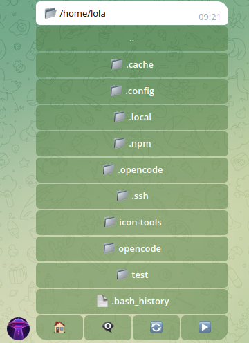

# tgdrive

A file system navigator for Telegram. The bot provides access to the server's file system right from the messenger — browse directories, download files, and execute shell commands.



## Features

- **File system navigation** — directories and files displayed as inline buttons with pagination
- **File delivery** — tap a file to have it sent to the chat (up to 50 MB)
- **Shell commands** — any text message is executed as a command in the current directory
- **Dot files** — 👁 button toggles visibility of hidden files
- **Bot commands** — `/start`, `/pwd`, `/ls`, `/cd <path>`
- **Authorization** — access restricted to specified Telegram IDs
- **Proxy** — HTTP/SOCKS5 proxy support

## Requirements

- PHP ≥ 8.0 (CLI)
- Extensions: `curl`, `json`, `mbstring`, `posix`

## Installation

```bash
# Install the script
sudo cp tgdrive.php /usr/bin/tgdrive
sudo chmod +x /usr/bin/tgdrive

# Run it — this will create a config template and exit
tgdrive

# Edit the configuration
nano ~/.config/tgdrive/config.php
```

The configuration file should look like this:

```php
<?php
$tg_token = '123456:ABC-DEF...';
$proxy_url = '';            // or 'socks5://127.0.0.1:9050'
$user_ids = [123456789];    // Telegram IDs of allowed users
```

Once configured, launch the bot:

```bash
tgdrive
```

## Systemd (autostart)

Install the user unit:

```bash
mkdir -p ~/.config/systemd/user
cp tgdrive.service ~/.config/systemd/user/
systemctl --user daemon-reload
systemctl --user enable --now tgdrive
```

View logs:

```bash
journalctl --user -u tgdrive -f
```

## Usage

### Navigation

The bot displays directory contents as inline buttons. Directories are marked with 📁, files with 📄. The bottom row contains:

| Button | Action |
|---|---|
| ⬆️ Up | Go to parent directory |
| 🏠 Home | Return to home directory |
| 👁 | Toggle dot file visibility |
| ◀️ ▶️ | Paginate when there are many entries |

Tapping a folder enters it. Tapping a file sends it to the chat.

### Bot commands

| Command | Description |
|---|---|
| `/start` | Reset state, start from home directory |
| `/pwd` | Print current directory |
| `/ls` | Full file listing as text |
| `/cd <path>` | Change directory (absolute or relative path, `~`, `..`) |

### Shell commands

Any text message not starting with `/` is executed as a shell command in the current directory. Output (stdout + stderr) is sent back to the chat.

## License

MIT
